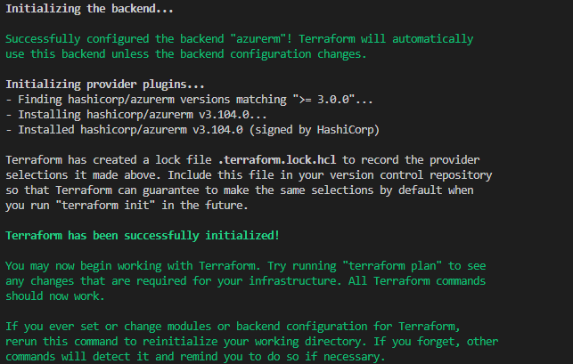

# Setup environment

- [Setup environment](#setup-environment)
  - [Lab overview](#lab-overview)
  - [Objectives](#objectives)
  - [Instructions](#instructions)
    - [Before you start](#before-you-start)
    - [Exercise 1: Create a Storage Account and a Container (manual step)](#exercise-1-create-a-storage-account-and-a-container-manual-step)
    - [Exercise 2: Setup the template configuration](#exercise-2-setup-the-template-configuration)
      - [Create the configuration file](#create-the-configuration-file)
      - [Terraform init](#terraform-init)
    - [Exercise 3: Coding style and conventions](#exercise-3-coding-style-and-conventions)
    - [Exercise 4: Make it more dynamic](#exercise-4-make-it-more-dynamic)
      - [Use an environment variable to select the subscription](#use-an-environment-variable-to-select-the-subscription)
      - [Use partial backend configuration](#use-partial-backend-configuration)

## Lab overview

Terraform is an IAC tool that allows you to build, change and version cloud resources safely and efficiently.  
Before being able to deploy to any cloud provider, the tool must first be configured.  
This setup includes the following:

- **Providers**: Providers are plugins used to interact with Cloud Providers APIs.

- **Authentication**: Terraform must authenticate to the Cloud API to create infrastructure.

- **Backend**: Terraform uses a backend file, called *tfstate*. This file is used to map real-world resources to the configuration template. It is mandatory for Terraform and essential fortracking resource changes.

In this lab, you will learn how to setup this three aspects of the Terraform configuration by defining a Terraform template.

## Objectives

After you complete this lab, you will be able to:

- Setup a new Terraform project.

## Instructions

### Before you start

- Ensure Terraform (version ~> 1.13.0) is installed and available from system PATH.
- Ensure Azure CLI is installed.
- Check your access to the Azure Subscription and Resource Group provided for this training.

### Exercise 1: Create a Storage Account and a Container (manual step)

In order to store the Terraform *tfstate* file, we're going to use a Blob Storage.

By default, Terraform will create this file locally, in a file named `terraform.tfstate`.  
This file contains information on real-world infrastructure, including sensitive data (for instance, Virtual Machines admin account password).  
It is recommanded to prefer using a remote than a local *tfstate* file that will answer the following use cases:

- Because a deployment can be required when the author of the template is on vacation, collaborative work should be the norm,
- Using a file in a network share can be seen as a collaboration process, but this won't protect from collision if there are multiple deployments at the same time (no lock handling),
- In Production environments Terraform templates, including tfstates, should be kept secure and encrypted, from one side using a source code repository, and from the other side storing the tfstate in a secure environment where you define access control.

Use an Azure Blob storage to store the *tfstate*.  
Benefits are:

- *tfstate* won't be committed in source code by mistake (as not present in tree hierarchy),
- Access to the *tfstate* is managed using RBAC or SAS (Shared Access Signature) token,
- Blob Storage has a native lock feature used by Terraform, protecting from collision in case of multiple deployments at same time.

**Exercise steps:**
From the Azure portal

1. (Manually) Create a Storage Account (globally unique name) 
2. Add a container (e.g. `tfstate`)

Notes:

> Terraform will **not** create this storage location, it assumes it exists.  
> This should be the **unique manual creation** when you use Terraform.
> The creation of this storage can also be done using AZ CLI or Powershell.

### Exercise 2: Setup the template configuration

#### Create the configuration file

1. In a local empty folder, create a file named `main.tf`

    > The name of the file is not important, only its extension is.  
    > `main.tf` is only a convention.

1. In this file, add the following configuration block

    ```hcl
    terraform {
      required_version = "~> 1.13.0"
    }
    ```

    The `required_version` setting allows you to set a version constraint on the installed Terraform version.

    |Operator|Description|
    |-|-|
    |=,no operator|Allows only one exact version number. Cannot be combined with other conditions.|
    |!=|Excludes an exact version number.|
    |>,>=,<,<=|Compares to a specified version. Terraform allows versions that resolve to true.<br>The > and >= operators request newer versions.<br>The < and <= operators request older versions.|
    |~>|Allows only the right-most version component to increment.<br>Examples:<br>~> 1.0.4: Allows Terraform to install 1.0.5 and 1.0.10 but not 1.1.0.<br>~> 1.1: Allows Terraform to install 1.2 and 1.10 but not 2.0.|

1. In the **Terraform configuration block**, add the backend configuration using information on the Storage Account you created previously:

    ```hcl
    backend "azurerm" {
      resource_group_name  = "name of the Resource Group where is stored the newly created Storage Account"
      storage_account_name = "name of the newly created Storage Account"
      container_name       = "Name of the newly created container"
      key                  = "training.tfstate"
    }
    ```

    > There are multiple types of backend that might be used. All majors Cloud Providers have their own (s3 for AWS, gcs for GCP, ...).  
    > This configuration is valid for an authentication using AZ CLI. If you're using a Service Principal or a Managed Identity, additional fields may be mandatory.  

    Refer tp https://developer.hashicorp.com/terraform/language/backend/azurerm

1. In the **Terraform configuration block**, add the provider requirements:

    ```hcl
    required_providers {
      azurerm = ">= 4.0.0"
    }
    ```

    You can set here a version constraint on the provider.

1. Next to the Terraform configuration block, add a provider block for configuration of the azurerm provider:

    ```hcl
    provider "azurerm" {
      # required when the User, Service Principal, or Identity running Terraform lacks the permissions to register Azure Resource Providers
      resource_provider_registrations = "none"
      features {}
      subscription_id = "Id of the provided subscription"
    }
    ```

    Main settings that can be set in the configuration of the *azurerm* provider:
    - **resource_provider_registrations**: (Optional) Set of Azure Resource Providers to automatically register when initializing the AzureRM Provider, set it to `none` (by default, Terraform will attempt to register any Resource Providers that it supports on launch),
    - **feature**: List of features that might be activated on the provider,
    - **subscription_id**: The Id of the subscription where to deploy resources.

    > All the available settings can be found [here](https://registry.terraform.io/providers/hashicorp/azurerm/latest/docs)

The full content of the file should be:

```hcl
terraform {
  required_version = "~> 1.13.0"

  backend "azurerm" {
    resource_group_name  = "name of the Resource Group of the Storage Account"
    storage_account_name = "name of the Storage Account"
    container_name       = "Name of the container"
    key                  = "training.tfstate"
  }

  required_providers {
    azurerm = ">= 4.0.0"
  }
}

provider "azurerm" {
  # required when the User, Service Principal, or Identity running Terraform lacks the permissions to register Azure Resource Providers
  resource_provider_registrations = "none"
  features {}
  subscription_id = "Id of the provided subscription"
}
```

> Do not waste time trying to format the template nicelly. Use the `terraform fmt -recursive` command instead.  
Get details at https://www.terraform.io/docs/cli/commands/fmt.html.

#### Terraform init

Once your template is ready, open a new shell session and login using AZ CLI

```powershell
az login [--tenant "tenant_id"]
az account set --subscription "subscription_id"
```

The first Terraform command to run after you created your init template is:

```powershell
terraform init
```

This command has no side effects on the cloud resources (it will **not** modify any resources nor update the *tfstate* file).  
It can be run anytime.

It will:

- Intialize the backend
- Download the providers.



> Look at the `.terraform` folder to see the installed provider(s).
> Look at your Storage Account, the *tfstate* is now present in the container.

### Exercise 3: Coding style and conventions

> This step is not mandatory but will allow you to keep your template files readable and maintenable over time.  
You should adopt this convention as soon as possible.

To keep a clean organization in your folder, split the `main.tf` file:

- create a new file named `version.tf` that contains the Terraform configuration block,
- create a new file named `providers.tf` that contains the provider azurerm block.

Run the `terraform init` command to ensure this refactoring is correct.

### Exercise 4: Make it more dynamic

> This step is not mandatory but will allow you to keep your template files readable and maintenable over time.  
You should adopt this convention as soon as possible.

Some settings in this template may vary when deploying to different environments:

- the subscription,
- the backend configuration (either Storage Account, container or key).

#### Use an environment variable to select the subscription

The subscription where deployment is to be performed can be sourced from an environment variable, named `ARM_SUBSCRIPTION_ID`.  
Using this mechanism allows you to keep a template free from any configuration settings.  

Remove the *subscription_id* from the provider configuration block in the `providers.tf` file.  
It now should be:

```hcl
provider "azurerm" {
  # required when the User, Service Principal, or Identity running Terraform lacks the permissions to register Azure Resource Providers
  resource_provider_registrations = "none"
  features {}
}
```

Open a (new) shell session, and run the following commands:

```powershell
az login [--tenant "Tenant Id"]
$env:ARM_SUBSCRIPTION_ID="Id of the provided training subscription"
terraform init
```

#### Use partial backend configuration

You can define the backend configuration using command line parameters, or from data stored in an external file.  
This mechanism is called *partial configuration*.

> For an overview of partial configuration, see https://developer.hashicorp.com/terraform/language/backend#partial-configuration.

1. Create a folder called *configuration* and add a file named `dev-backend.hcl`
1. Edit this file adding the content of the following backend configuration block in this file.  
   It should be

    ```hcl
    resource_group_name  = "name of the Resource Group of the Storage Account"
    storage_account_name = "name of the Storage Account"
    container_name       = "Name of the container"
    key                  = "training.tfstate"
    ```

1. Remove the content of the backend configuration block in your `version.tf`, and leave it empty.

    ```hcl
    backend "azurerm" {}
    ```

We can now set the backend using the CLI option, running the following command:

```powershell
terraform init -backend-config=".\configuration\dev-backend.hcl"
```
