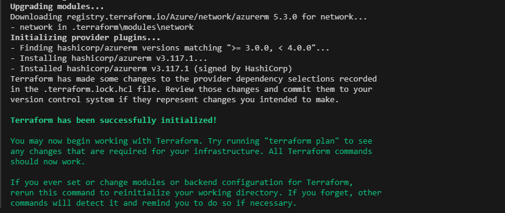

# Setup environment

- [Setup environment](#setup-environment)
  - [Lab overview](#lab-overview)
  - [Objectives](#objectives)
  - [Instructions](#instructions)
    - [Before you start](#before-you-start)
    - [Exercise 1: Download a module](#exercise-1-download-a-module)
      - [Use your existing Resource Group](#use-your-existing-resource-group)
      - [Download a VNET module](#download-a-vnet-module)
    - [Exercise 2: Instantiate the module](#exercise-2-instantiate-the-module)
    - [Exercise 3: Remove resources](#exercise-3-remove-resources)

## Lab overview

In this lab, you will learn how to use modules from the gallery.

## Objectives

After you complete this lab, you will be able to:

-   Download a module
-   Instantiate resources from a module.

## Instructions

### Before you start

- Ensure Terraform (version >= 1.0.0) is installed and available from system PATH.
- Ensure Azure CLI is installed.
- Check your access to the Azure Subscription and Resource Group provided for this training.
- Your environment is setup and ready to use from the lab *1-Setup environment*.

### Exercise 1: Download a module

#### Use your existing Resource Group

Create a `data.tf` file, and add the following `data` block to reference your Resource Group:

```hcl
data "azurerm_resource_group" "rg_training" {
  name = "your_resource_group_name"
}
```

> Since this Resource Group has been created outside of Terraform, we are using a data block to retrieve its configuration.  
> No change will be done on this Resource Group, this template does not manage its lifecyle.  

#### Download a VNET module

Create a `network.tf` file, and add the following blocks to reference a module from the gallery:

```hcl
module "network" {
  source              = "Azure/network/azurerm"
  version             = "5.3.0"
  resource_group_name = data.azurerm_resource_group.rg_training.name
  address_spaces      = ["10.0.0.0/16", "10.2.0.0/16"]
  subnet_prefixes     = ["10.0.1.0/24", "10.0.2.0/24", "10.0.3.0/24"]
  subnet_names        = ["subnet1", "subnet2", "subnet3"]
  use_for_each        = true
}
```

> The documentation on this module can be found at https://registry.terraform.io/modules/Azure/network/azurerm/latest.  
> Module download is done when `terraform init` is run. If you add a module in your template, run `terraform init` to download it.

Open a new shell and run the following commands:

```powershell
az login
$env:ARM_SUBSCRIPTION_ID="[Id of the provided training subscription]"
terraform init -backend-config=".\configuration\dev-backend.hcl"
```

You might get an error on incompatible versions between the root AzureRM provider and the one required for the module...  


You can run the `terraform providers` command for more details and decide on what action to take:


In that case, we can see the version of the AzureRM provider requested by the the VNET module is `>= 3.0.0, < 4.0.0` where the version of the root AzureRM provider is `>= 4.0.0`.  
Here, one possible solution is to update the AzureRM provider version in `version.tf` file to fit the module request (here a version downgrade):

```hcl
terraform {
  required_version = ">= 1.0.0"

  backend "azurerm" {}

  required_providers {
    azurerm = ">= 3.0.0"
  }
}
```
And next run the `init` command with `-upgrade`

```powershell
terraform init -backend-config=".\configuration\dev-backend.hcl" -upgrade
```

Now the module is correctly donwloaded



> The downloaded module can be found in the *.terraform* folder.  
> 
> **!BEWARE!**  
> Downgrading a module version is **not** the most recommended approach...  
> This will surely imply to also modify some of the provider configuration and resources configurations.  
> 
> One example here is the `resource_provider_registrations = none` provider feature added in v4 in replacement to `skip_provider_registration = true`.  
> With the downgrade to v3 for AzureRM provider, we also need to replace that argument in the provider block!  
> Please proceed now or you will get an error at `terraform plan/apply` steps.  

### Exercise 2: Instantiate the module

Run the following commands:

```powershell
terraform plan
terraform apply
```

Confirm the creation (*yes* response).  
Use the Azure portal to confirm resources creation. 

### Exercise 3: Remove resources

Run the `destroy` command

```powershell
terraform destroy
```

Confirm the deletion (*yes* response).

Note:
> `apply` and `destroy` commands accept an `-auto-approve` option to the command line that avoids querying for user validation.  
> This is to be used carefully, e.g. to avoid accidently deleting resources.

Use the Azure portal to confirm resources deletion.

