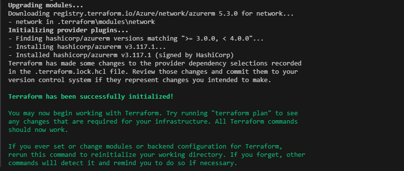

# Setup environment

- [Setup environment](#setup-environment)
  - [Lab overview](#lab-overview)
  - [Objectives](#objectives)
  - [Instructions](#instructions)
    - [Before you start](#before-you-start)
    - [Exercise 1: Download a module](#exercise-1-download-a-module)
    - [Exercise 2: Instantiate a module](#exercise-2-instantiate-a-module)
    - [Exercise 3: Remove resources](#exercise-3-remove-resources)

## Lab overview

In this lab, you will learn how to use modules from the gallery.

## Objectives

After you complete this lab, you will be able to:

-   Download a module
-   Instantiate resources from a module.

## Instructions

### Before you start

- Ensure Terraform (version >= 1.0.0) is installed and available from system's PATH.
- Ensure Azure CLI is installed.
- Check your access to the Azure Subscription and Resource Group provided for this training.
- Your environment is setup and ready to use from the lab *1-Setup environment*.

### Exercise 1: Download a module

Create a `data.tf` file, and add the following `data` block to reference your Storage Account:

```hcl
data "azurerm_resource_group" "training-rg" {
  name = "your_resource_group_name"
}
```

> Since this Resource Group has been created outside of Terraform, we are using a data block to retrieve its configuration.
> No change will be done on this Resource Group, this template does not manage its lifecyle.  

Create a `network.tf` file, and add the following blocks to reference a module from the gallery:

```hcl
module "network" {
  source              = "Azure/network/azurerm"
  resource_group_name = data.azurerm_resource_group.training-rg.name
  address_spaces      = ["10.0.0.0/16", "10.2.0.0/16"]
  subnet_prefixes     = ["10.0.1.0/24", "10.0.2.0/24", "10.0.3.0/24"]
  subnet_names        = ["subnet1", "subnet2", "subnet3"]
  use_for_each        = true
}
```

> The documentation on this module can be found at https://registry.terraform.io/modules/Azure/network/azurerm/latest.  
> Module download is done when `terraform init` is run. If you add a module in your template, run `terraform init` to download it.

Open a new shell and run the following commands:

```powershell
az login
$env:ARM_SUBSCRIPTION_ID="[Id of the provided training subscription]"
terraform init -backend-config=".\configuration\dev-backend.hcl"
```



> The downloaded module can be found in the *.terraform* folder.

### Exercise 2: Instantiate a module

Run the following commands:

```powershell
terraform plan
```

```powershell
terraform apply
```

Confirm the creation, approving with *yes*.  

Use the Azure portal to confirm resources creation. 

### Exercise 3: Remove resources

Run the `destroy` command

```powershell
terraform destroy
```

Confirm the deletion, approving with *yes*.

Note:
> `apply` and `destroy` commands accept an `-auto-approve` option to the command line that avoids querying for user validation.  
> This is to be used carefully, e.g. to avoid accidently deleting resources.

Use the Azure portal to confirm resources deletion.

